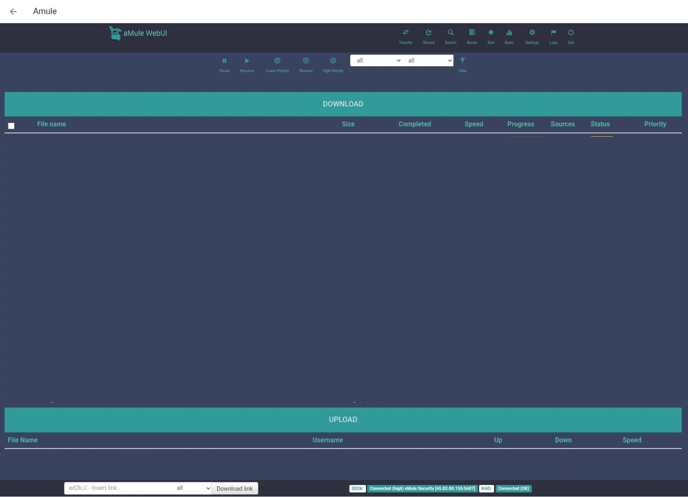

# Amule For HomeAssistant

[aMule](https://github.com/amule-project/amule) is a multi-platform client for the ED2K file sharing network and based on the windows client eMule. aMule started in August 2003, as a fork of xMule, which is a fork of lMule.

[]

Inspired by [ngosang](https://github.com/ngosang/docker-amule/releases) work.

## Docker Registry

## Supported Architectures

The architectures supported by this image are:

* linux/amd64
* linux/arm/v6
* linux/arm/v7
* linux/arm64/v8
* linux/ppc64le
* linux/riscv64
* linux/s390x

## Application Setup

The web interface is at: `<Homeassistant Server IP>:4711`

For better download speed you have to open these ports:

* 4662 TCP
* 4665 UDP
* 4672 UDP

## Usage

## Parameters

The addon configuration has below parameters customizable:

| Parameter | Function |
| :----: | --- |
| `4711` | Web UI port. |
| `4712` | Remote gui, webserver, cmd port. |
| `4662` | ED2K TCP port (must be open to Internet). |
| `4665/udp` | ED2K global search UDP port (tcp port +3) (must be open to Internet). |
| `4672/udp` | ED2K UDP port (must be open to Internet). |
| `GUI_PWD=<fill_password>` | Set Remote GUI password. It will overwrite the password in the config files. |
| `WEBUI_PWD=<fill_password>` | Set Web UI password. It will overwrite the password in the config files. |
| `MOD_AUTO_RESTART_ENABLED=true` | Enable aMule auto restart. Check modifications section. |
| `KAD_NODES_DAT_URL` | Define nodes.dat URL |
| `ED2K_SERVERS_URL` | Define ED2K Servers URL |

Due to Home Assistant's restrictions imposed on add-ons, the incoming and temp directories cannot be customized. The default paths are as follows:

| Folder | Path |
| :----: | --- |
| `Incoming` | /root/media/amule/incoming |
| `Temp` | /root/media/amule/temp |

### aMule Web UI Reloaded theme

The Docker image includes the classic aMule Web UI and [AmuleWebUI-Reloaded](https://github.com/MatteoRagni/AmuleWebUI-Reloaded) theme.

### Auto restart mod

aMule has some issues that cause it to stop working properly after a few days:
* [Memory leak](https://github.com/amule-project/amule/issues/314)
* [Network disconnection](https://github.com/amule-project/amule/issues/315)

As workaround, we have implemented a cron scheduler to restart aMule everyday at 6:00h. To enable this mod set this option to true:
* `MOD_AUTO_RESTART_ENABLED=true`

### Fix Kad stats graph mod

aMule has an issue when it renders Kad stats graph that [crash the application](https://github.com/amule-project/amule/issues/265). The crash happens when you enter in the Web UI stats after few days running.

As workaround, we removed the image causing the issue from the Web UI. Since the image is not requested the server doesn't crash.

### Fix Kad bootstrap mod

aMule [does not download the nodes.dat file](https://github.com/ngosang/docker-amule/issues/33) required to bootstrap the Kad network. This causes it not to connect to the Kad network.

As workaround, we are downloading the `nodes.dat` file before starting aMule. The file is only downloaded if it has not been downloaded before.
